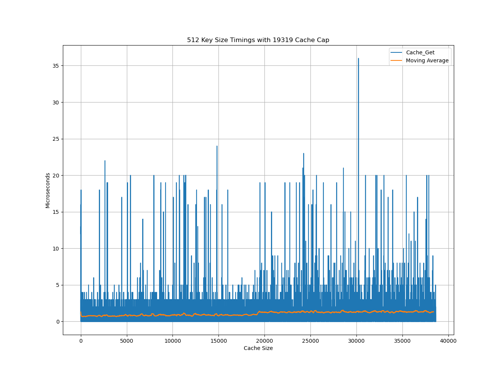
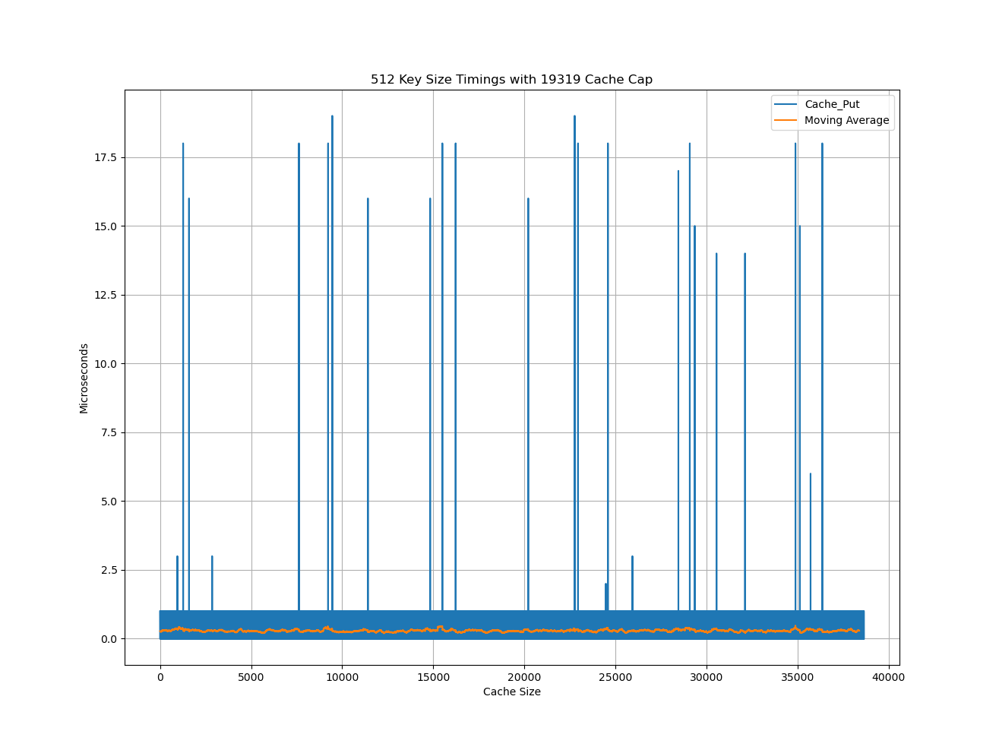

# Micro Cache (ucache)

Micro cache stores key value pairs using a simplified LRU cache.

Keys are strings and are copied on use. Values are not copied but will
be freed once the cache is freed.

The LRU is compromised of a hash map with singly linked bucketed nodes
for O(1) read and insertion and a doubly linked list for maintaining
deletion order. The cache does not grow beyond capacity -
least used key value pairs are deleted to make room for new key value
insertions.

## Example use

`gcc main.c ucache.c && ./a.out`

`main.c`

```
#include "ucache.h"

#include <stdio.h>
#include <stdlib.h>

int*
Int(int x)
{
    int* i = malloc(sizeof(*i));
    *i = x;
    return i;
}

int
main(void)
{
    Cache* cache = Cache_Init(7);
    Cache_Put(cache, "A", Int(0));
    Cache_Put(cache, "B", Int(1));
    Cache_Put(cache, "D", Int(2));
    printf("%d\n", *(int*) Cache_Get(cache, "D"));
    Cache_Kill(cache);
    return 0;
}
```

## Performance

Read and write performance is O(1).
Every read requires a key value pair reprioritization and therefor is marginally
slower than writes. Read and write speed may degrade when the cache cap is reached.
Below, read speed halves when the cap size (19319) is reached.

### Read (Cache_Get)


### Write (Cache_Put)

